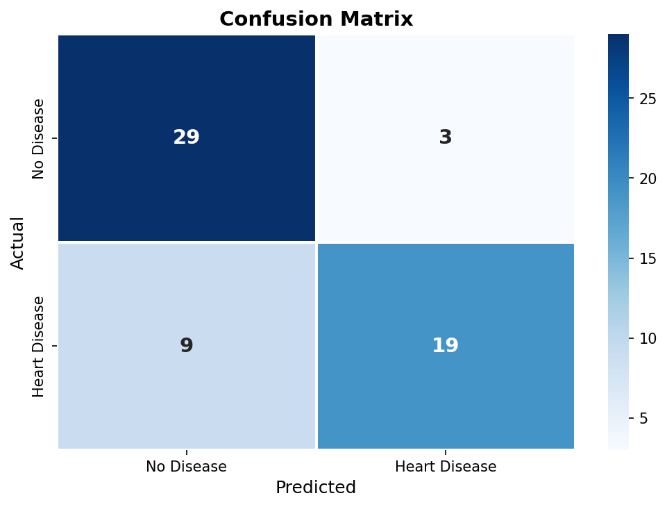
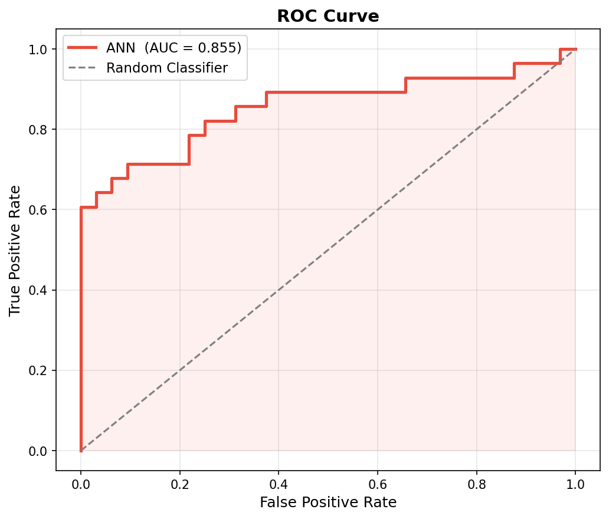
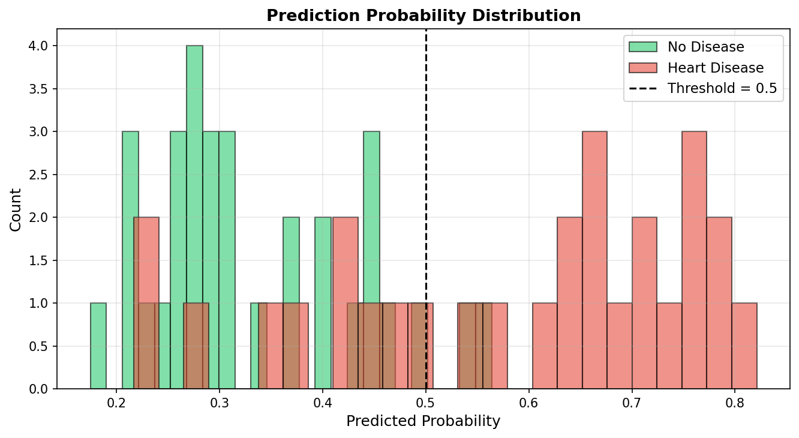

# ❤️ Heart Disease Detection using ANN

A machine learning web application that predicts heart disease risk using an Artificial Neural Network (ANN) trained on the Cleveland Heart Disease dataset.


---

## 🖥️ Live Demo

🔗 **[https://heart-disease-prediction-kf9k.onrender.com](https://heart-disease-prediction-kf9k.onrender.com)**

> ⚠️ Note: First load may take 30–50 seconds (free tier sleep mode). Please wait!

---

## 📌 About The Project

Heart disease is one of the leading causes of death worldwide. Early detection can save lives. This project uses an Artificial Neural Network to predict whether a patient has heart disease based on 13 medical features.

**Input:** Patient medical data (age, cholesterol, blood pressure, etc.)
**Output:** Heart Disease Detected 🚨 or No Heart Disease ✅ with probability %

---

## 📁 Project Structure

```
heart-disease-prediction/
├── app/
│   ├── app.py
│   ├── templates/
│   │   ├── index.html
│   │   └── result.html
│   └── static/
│       └── style.css
├── assests/
│   ├── roc_curve.png
│   ├── confusion_matrix.png
│   └── prediction_distribution.png
├── data/
│   └── heart.csv
├── notebooks/
│   └── eda.ipynb
├── src/
│   ├── preprocess.py
│   ├── model.py
│   └── evaluate.py
├── results/
│   ├── best_model.keras
│   └── scaler.pkl
├── requirements.txt
├── Procfile
├── .gitignore
└── README.md
```

---

## 📊 Dataset

| Property | Detail |
|----------|--------|
| Source | [Cleveland Heart Disease - UCI](https://archive.ics.uci.edu/dataset/45/heart+disease) |
| Kaggle | [Download Here](https://www.kaggle.com/datasets/cherngs/heart-disease-cleveland-uci) |
| Samples | 303 patients |
| Features | 13 original + 4 engineered = 17 total |
| Target | 1 = Heart Disease, 0 = No Disease |

### Features Used

| Feature | Description |
|---------|-------------|
| `age` | Age of patient |
| `sex` | Gender (1=Male, 0=Female) |
| `cp` | Chest pain type (0–3) |
| `trestbps` | Resting blood pressure |
| `chol` | Cholesterol level |
| `fbs` | Fasting blood sugar |
| `restecg` | Resting ECG result |
| `thalach` | Max heart rate achieved |
| `exang` | Exercise induced angina |
| `oldpeak` | ST depression |
| `slope` | ST slope |
| `ca` | Major vessels count |
| `thal` | Thalassemia |
| `age_group` | ⭐ Engineered feature |
| `high_chol` | ⭐ Engineered feature |
| `high_bp` | ⭐ Engineered feature |
| `hr_ratio` | ⭐ Engineered feature |

---

## 🧠 ANN Architecture

```
Input  Layer  →  17 neurons
Hidden Layer1 →  64 neurons  (ReLU + BatchNorm + Dropout 0.3)
Hidden Layer2 →  32 neurons  (ReLU + BatchNorm + Dropout 0.2)
Hidden Layer3 →  16 neurons  (ReLU + Dropout 0.1)
Output Layer  →   1 neuron   (Sigmoid)
```

| Setting | Value |
|---------|-------|
| Optimizer | Adam (lr=0.001) |
| Loss Function | Binary Crossentropy |
| Max Epochs | 200 |
| Early Stopping | Patience = 20 |
| Batch Size | 32 |
| Validation Split | 20% |

---

## 📈 Model Performance

### Metrics

| Metric | Score |
|--------|-------|
| ✅ Accuracy | **80.00%** |
| 🎯 Precision | **86.36%** |
| 🔍 Recall | **67.86%** |
| ⚖️ F1 Score | **75.82%** |
| 📉 AUC-ROC | **85.50%** |

---

### Confusion Matrix

```
                  Predicted
               No Disease  |  Heart Disease
             ─────────────────────────────
Actual  No  |     29      |       3       |
       Yes  |      9      |      19       |
             ─────────────────────────────
```

| | Value | Meaning |
|--|-------|---------|
| ✅ True Negative (TN) | 29 | Correctly identified No Disease |
| ✅ True Positive (TP) | 19 | Correctly identified Heart Disease |
| ⚠️ False Positive (FP) | 3 | Healthy predicted as Diseased |
| ❌ False Negative (FN) | 9 | Diseased predicted as Healthy |



---

### ROC Curve

> AUC = 0.855 — Model has **85.5% ability** to distinguish between diseased and healthy patients.



---

### Prediction Probability Distribution

> Green = No Disease | Red = Heart Disease | Threshold = 0.5



---

## ⚙️ Setup & Run Locally

### 1. Clone the repository
```bash
git clone https://github.com/pritam1952/heart-disease-prediction.git
cd heart-disease-prediction
```

### 2. Create virtual environment
```bash
python -m venv ml_env
ml_env\Scripts\activate       # Windows
source ml_env/bin/activate    # Mac/Linux
```

### 3. Install dependencies
```bash
pip install -r requirements.txt
```

### 4. Add dataset
Download `heart.csv` from [Kaggle](https://www.kaggle.com/datasets/cherngs/heart-disease-cleveland-uci) and place it inside `data/` folder.

### 5. Train the model
```bash
cd src
python preprocess.py
python model.py
python evaluate.py
```

### 6. Run Flask app
```bash
cd app
python app.py
```

Open: **http://127.0.0.1:5000**

---

## 🛠️ Tech Stack

| Category | Tools |
|----------|-------|
| Language | Python 3.11 |
| ML Framework | TensorFlow 2.16.1 / Keras |
| Data Processing | Pandas, NumPy, Scikit-learn |
| Visualization | Matplotlib, Seaborn |
| Web Framework | Flask |
| Deployment | Render (Free Tier) |

---

## 🌐 Deployment

Deployed on **Render** — [render.com](https://render.com)

Start command:
```
gunicorn app.app:app --timeout 120 --workers 1 --threads 2
```

---

## ⚠️ Disclaimer

> This project is for **educational purposes only**.
> Do NOT use this as a substitute for professional medical advice.
> Always consult a qualified doctor for medical diagnosis.

---

## 👤 Author

**Pritam Kumar**
- GitHub: [@pritam1952](https://github.com/pritam1952)
- Project: [heart-disease-prediction](https://github.com/pritam1952/heart-disease-prediction)

---

## 📄 License

This project is open source and available under the [MIT License](LICENSE).

---

⭐ **If you found this project helpful, please give it a star on GitHub!**